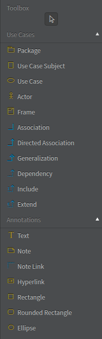

 # Intro
- Purpose is to visualize the functional requirement of the system
- Starting point of object oriente decomposition  
- Goal - create abstraction from the problem domain.

Steps of drawing use case diagram :- 
- Apply your english grammer skill, Find the key objects, identify 
    - noun -> Name of the class
    - Verb -> Operation/Method of the class
    - Adjective -> Property of the class 
- How they interact with each other.
- Define the internal behavior of the each object.

Benefit : It uses natural language os this diagram i understandable by anybody. Decomposes a large system spec into small and managable parts.

## How to write use case desctiption - 
- Goal
- Precondition
- Successful end conition
- Failed end condition
- Primary actors(goes left in the use case diagram)
- Seconary actors(goes right in the use case diagram)
- Trigger
- Main flow
- Extentions

** Just list out the use cases, no technical details, no  if else, no order, just document what is possible to do using the system, what goals we can achieve using the system. 
** Use case diagram, who can/needs to do what in a system.

*** WHEN WE NEED TO ADD LOGIC , if else , order of exection etc, we use activity diagram. That's the next step of use case diagram.(step 02)

#### Use case diagram components - 

