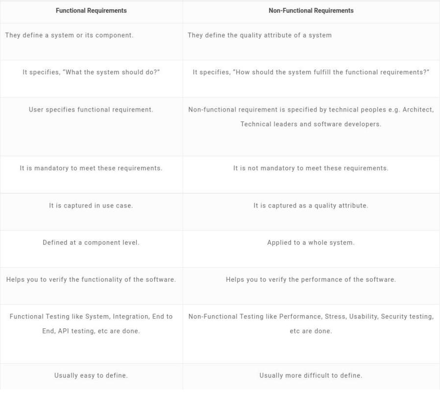

# Non functional requirement for software 
## A non-functional requirement will describe how a system should behave and what limits there are on its functionality.
## Non-functional requirements specify the system’s ‘quality characteristics’ or ‘quality attributes’.
- Performance – for example Response Time, Throughput, Utilization, Static Volumetric
- Scalability
- Capacity
- Availability
- Reliability
- Recoverability
- Maintainability
- Serviceability
- Security
- Regulatory
- Manageability
- Environmental
- Data Integrity
- Usability
- Interoperability

# Functional requirement for software 
## “Any Requirement Which Specifies What The System Should Do.”
- Business Rules
- Transaction corrections, adjustments and cancellations
- Administrative functions
- Authentication
- Authorization levels
- Audit Tracking
- External Interfaces
- Certification Requirements
- Reporting Requirements
- Historical Data
- Legal or Regulatory Requirements

* One article to rule them all
https://reqtest.com/requirements-blog/functional-vs-non-functional-requirements/

# Some comparison
Funtional requiremenmt <=> Non functuional requirement
- Prouct feature <=> Product properties
- User requirement <=> User expectation 

# How to gather functional and non-functional requirements?
Guided brainstorming session is one of the best ways to gather requirements by getting all stakeholders together. You should include user representatives who are the best sources of non-functional requirements.

*Basically functional requirements can be divided into 4 groups which are:*

- Business requirements. They contain the ultimate goal, such as an order system, an online catalogue, or a physical product. It can also include things like approval workflows and authorization levels.

- Administrative functions. They are the routine things the system will do, such as reporting.

- User requirements. They are what the user of the system can do, such as place an order or browse the online catalogue.

- System requirements. These are things like software and hardware specifications, system responses, or system actions.

*Once the functional requirements are defined then its time to think about the non-functional requirements, such as:*

- Usability. This focuses on the appearance of the user interface and how people interact with it. What colour are the screens? How big are the buttons?

- Reliability / Availability. What are the uptime requirements? Does it need to function 24/7/365?

- Scalability. As needs grow, can the system handle it? For physical installations, this includes spare hardware or space to install it in the future.

- Performance. How fast does it need to operate?

- Supportability. Is support provided in-house or is remote accessibility for external resources required?

- Security. What are the security requirements, both for the physical installation and from a cyber perspective?

# Conclusion:- 
https://reqtest.com/blog/ this site is really good to learn project management. Lots of example, fits right into the imporant issues of software development. 

Always document your code.
